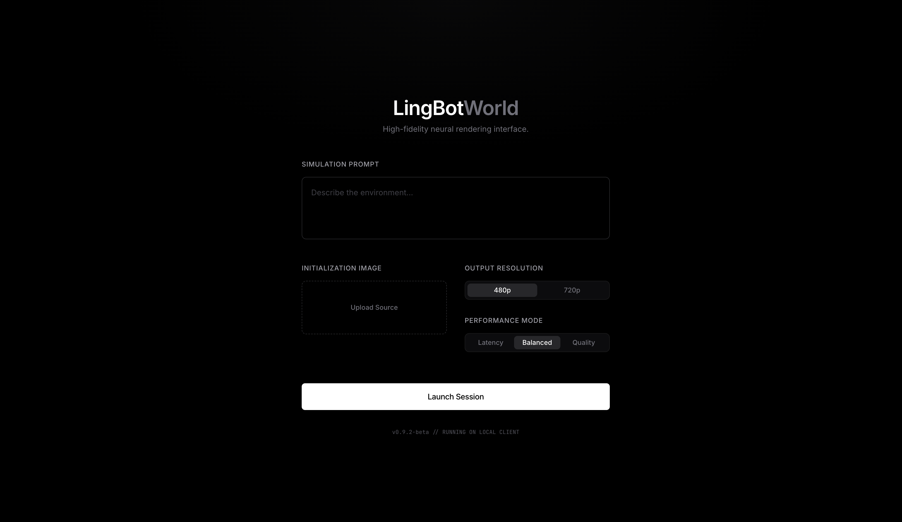
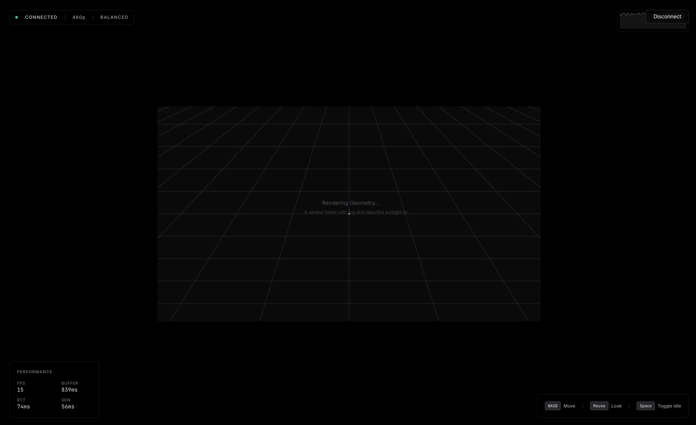

> [!IMPORTANT]  
> Currently a work in progress - I have a working WASD movement with [lingbot-world-base-cam](https://huggingface.co/robbyant/lingbot-world-base-cam) - but the framework is insufferably slow (~1 FPS). Gonna wait until **LingBot-World-Fast** is released. 





## Run Locally
**Prerequisites:**  Node.js, python, CUDA

1. Install dependencies:
   `npm install`
2. Run the app:
   `npm run dev`


3. In a separate terminal, run the python websocket server
```bash
export CUDA_DEVICE_ORDER=PCI_BUS_ID
export CUDA_VISIBLE_DEVICES=1

export LINGBOT_MODEL_REPO=/home/aw/Documents/models/lingbot
export LINGBOT_MAX_SESSIONS=1
export LINGBOT_TARGET_FPS=2
export LINGBOT_CHUNK_FRAMES=1
export LINGBOT_LOW_WATER_FRAMES=1
export LINGBOT_HIGH_WATER_FRAMES=3
export LINGBOT_KEEP_MODELS_ON_GPU=0
export LINGBOT_STOP_ON_DISCONNECT=1
export LINGBOT_CORS_ORIGINS=*
export LINGBOT_T5_CPU=1
export LINGBOT_PRELOAD_ON_STARTUP=0
export LINGBOT_FORCE_RESOLUTION=480p

python -m uvicorn server.main:app --host 0.0.0.0 --port 8000
```



